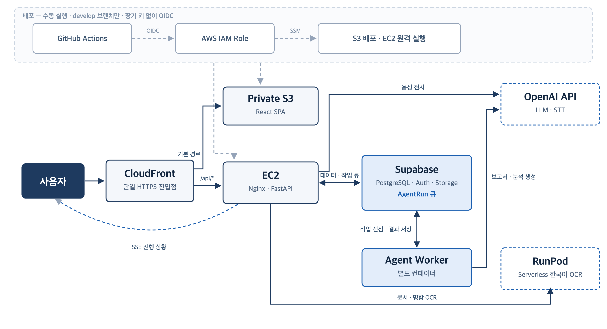
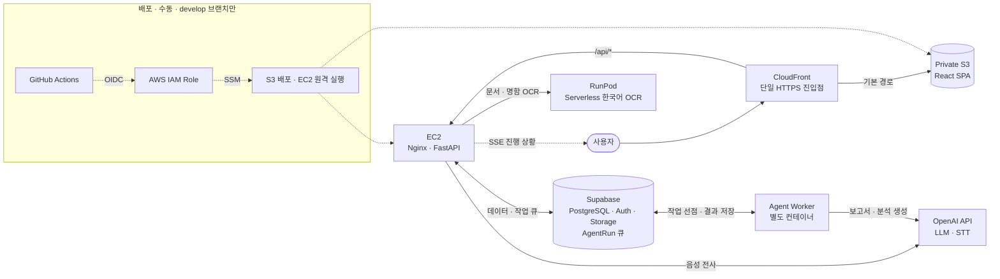

# SalesLuv — PPT 2장 (Tech Stack · System Architecture)

> 슬라이드에 그대로 들어갈 내용만 담았다. 각 항목의 코드 근거와 확실성은 [`ppt-2slides-detail.md`](ppt-2slides-detail.md) 참고.
>
> **주의**: AWS 계정 ID·IP·인스턴스 ID·버킷명·CloudFront 도메인은 슬라이드와 캡처 어디에도 넣지 않는다.

---

# Slide 1 — Tech Stack

> **한 줄 메시지**
> 영업 CRM과 AI 에이전트를 하나의 스택으로 붙였다.

### 슬라이드에 넣을 것

**Frontend**  React · TypeScript · Vite
컴포넌트로 화면을 조립하고, 타입으로 API 계약 오류를 배포 전에 잡는다

**Backend**  FastAPI · Python · SQLAlchemy
Python AI 생태계를 그대로 쓸 수 있고, API 문서가 자동 생성돼 프론트와의 협업이 빠르다

**Data · Auth**  Supabase (PostgreSQL · Auth · Storage)
DB·인증·파일 저장을 한 곳에서 받아, 인증 서버를 따로 만들지 않고 기능 개발에 집중

**AI · ML**  LangChain · OpenAI API · PaddleOCR · scikit-learn · CatBoost
provider를 갈아 끼울 수 있는 adapter로 붙여, 특정 업체에 묶이지 않게

**DevOps**  Docker · GitHub Actions · AWS (S3 · CloudFront · EC2)
실행 환경을 통일하고, 테스트·빌드·배포를 자동화

### 말로 할 것

- 이 프로젝트는 AI 기능이 핵심이라 **Python 생태계를 중심에 두고** 나머지를 맞췄다. LLM·OCR·ML 라이브러리를 그대로 쓸 수 있다는 게 백엔드를 고른 가장 큰 이유였다.

### 이미지 제작 설명

- **제목**: Tech Stack
- **포함 요소**: 5개 그룹. 각 그룹은 `이름 / 기술 3~5개 / 선택 이유 한 줄` 세 단으로 구성
- **배치**: 세로 5단. 선택 이유는 기술 이름보다 작고 흐린 글씨로 바로 아래
- **강조**: 기술 이름보다 **선택 이유 줄**. 이 슬라이드의 메시지는 나열이 아니라 판단이다
- **제외**: 린터·formatter·테스트 도구, 보조 라이브러리, 프레임워크에 딸려 오는 것(Pydantic·Uvicorn)과 SPA 기본 구성(React Router), 버전 번호 (React 19 / Python 3.13만 예외)

---

# Slide 2 — System Architecture

> **한 줄 메시지**
> 입구는 하나로 모으고, 오래 걸리는 AI 작업은 따로 떼어냈다.

### 슬라이드에 넣을 것

| 파일 | 용도 |
|---|---|
| [`architecture.svg`](architecture.svg) | **PPT 삽입용.** PowerPoint에서 `삽입 → 그림`으로 넣으면 확대해도 안 깨진다. 도형 분리도 가능(우클릭 → 그룹 해제) |
| [`architecture.png`](architecture.png) | 3280×1800. SVG가 안 되는 도구용 |

※ 점선 테두리 = 외부 서비스. OCR은 provider 교체 가능한 adapter 구조(RunPod · 로컬 PaddleOCR · OpenAI)로 만들었고 현재는 RunPod을 쓴다.

### 말로 할 것

- 화면과 서버, 데이터베이스를 하나로 묶어서 **주소 하나로 접속**하게 만들었다.
- AI가 보고서를 쓰는 데 시간이 걸려서, **기다리는 동안 화면이 멈추지 않도록** 처리를 따로 떼어냈다. 글자를 읽는 OCR도 속도와 서버 부담 때문에 외부 서비스로 뺐다.
- **GitHub에서 버튼 하나로 배포**되고, 올리는 중에도 서비스가 끊기지 않는다.

더 물어보면: 번호표 비유(2번), lease·재시도, blue/green 전환 → `ppt-2slides-detail.md` 3장·5장

### 이미지 제작 설명

- **제목**: System Architecture
- **포함 요소**: User, CloudFront, Private S3, EC2(Nginx·FastAPI), Supabase, AgentRun Queue, Agent Worker, RunPod OCR 워커, 외부 AI API (런타임 9개) + GitHub Actions, IAM Role, 배포 대상 (배포 3개)
- **배치**: 배포 경로는 **상단에 점선 영역**으로 분리, 런타임 경로는 하단에 좌 → 우 실선
- **강조**: ① CloudFront에서 갈라지는 두 경로(S3 / `/api/*`) ② API 직접 호출(OCR·STT)과 큐를 거치는 비동기 경로(LLM)의 분리. 이 두 갈래가 한눈에 보이게
- **제외**: AWS 계정 ID·IP·인스턴스 ID·버킷명·Distribution ID, EC2 내부 blue/green 슬롯 두 개, 개별 라우터·테이블 이름
- **색**: 네이비·블루 계열, 흰 배경. 배포 영역은 회색 점선. 외부 서비스는 점선 테두리
- **수정 방법**: 라벨·색만 바꾼다면 `architecture.svg`를 텍스트 편집기로 열어 고친다. 박스를 추가·삭제해 **배치를 다시 짜야 한다면** 아래 Mermaid를 고쳐 새로 그리는 편이 빠르다

<b>Mermaid 원본 (구조 변경 시 재생성용)</b>

SVG와 같은 내용이다. 박스를 추가하거나 흐름이 바뀌면 이쪽을 먼저 고친다.

---

## 발표 팁

- 시간이 부족하면 Slide 2의 말할 것 **②번(DB 큐 분리)** 하나만 확실히 전달한다. 나머지는 질문 받으면 답한다.
- 서비스 동작 확인: 2026-09-11 기준 `/api/health`, `/api/health/db` 모두 HTTP 200. "현재 운영 중"이라고 말해도 된다.
- 솔직하게 말할 것: CloudFront → EC2 구간은 아직 HTTP다. 커스텀 도메인·ACM 인증서가 없어 origin TLS를 적용하지 않았고, 다음 개선 항목이다. 먼저 인정하고 넘어가는 편이 낫다.
