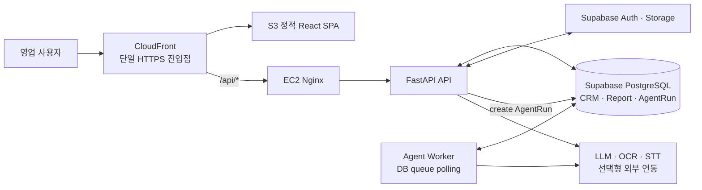
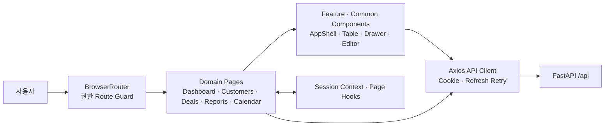
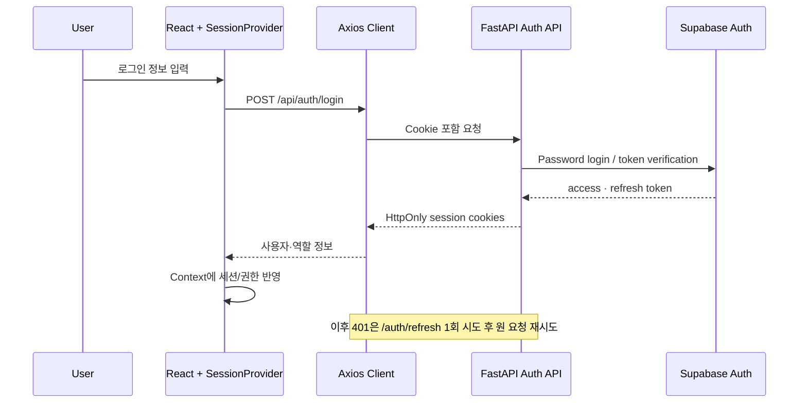
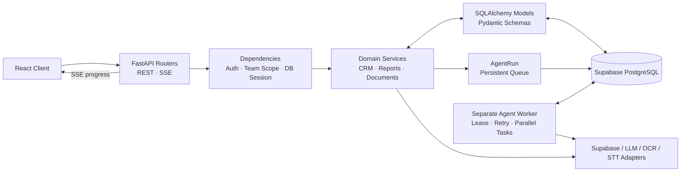
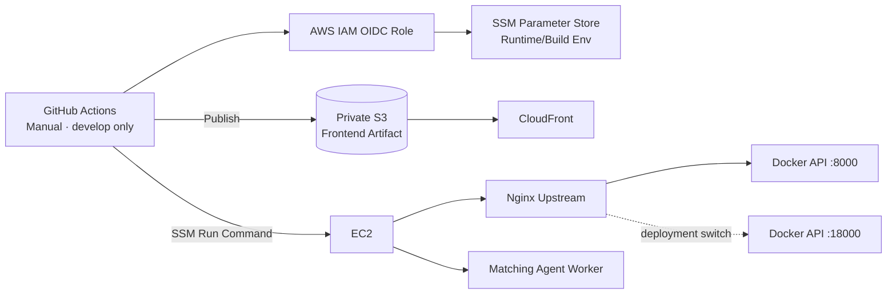

# SalesLuv 프로젝트 PPT 분석

> 분석 기준: 2026-09-11 현재 저장소의 추적 파일과 구현 코드. 설치된 패키지 목록만으로 판단하지 않고 실제 import·호출·배포 설정을 교차 확인했다. 저장소만으로 실시간 운영 상태를 검증할 수 없는 항목은 별도 표기한다.

## 0. 프로젝트 전체 구조 확인

| 영역 | 실제 역할 | 코드·파일 근거 |
| --- | --- | --- |
| `frontend/` | React SPA 화면, 세션, API 통신, 공통 UI | `src/main.tsx`, `src/App.tsx`, `src/api/client.ts` |
| `backend/` | FastAPI API, ORM, 업무 서비스, AI agent/worker, ML 로더 | `app/main.py`, `api/`, `services/`, `agents/`, `ml/` |
| `infra/runpod/document_ocr/` | 별도 배포 가능한 RunPod Serverless OCR worker 이미지 | `Dockerfile`, `handler.py`, `requirements.txt` |
| `deploy/backend/` | EC2 Docker 슬롯 전환 및 agent worker 기동 | `deploy.sh`, `tests/runtime-environment-test.sh` |
| `.github/workflows/` | frontend/backend CI와 수동 production 배포 | `ci-*.yml`, `deploy-*.yml`, `deploy-all.yml` |
| `backend/sql/` | 수동 적용 SQL migration 및 적용 가이드 | `backend/sql/README.md`, SQL 파일 |
| `docs/` | 프로젝트·DB·AI·배포 설계와 운영 기록 | `project-overview.md`, `technical/deploy/` |
| `data/` | 샘플·비식별화·전처리 데이터. 애플리케이션 런타임 소스는 아님 | `data/README.md` |

| 구성 항목 | 확인 결과 | PPT 처리 |
| --- | --- | --- |
| 패키지/빌드 | `frontend/package.json`, `frontend/package-lock.json`, `vite.config.ts`, `backend/pyproject.toml`, `backend/uv.lock` | 실제 사용 기술의 근거 |
| 환경 변수 | frontend/backend `.env.example`와 실제 `.env` 파일 존재 | 값은 노출하지 않고 연동 경계만 설명 |
| Docker | backend와 RunPod OCR에 Dockerfile 존재 | 컨테이너 구현 확인 |
| CI/CD | GitHub Actions workflow 존재 | 구현·설정 확인 |
| DB migration | `backend/sql/` 수동 SQL 적용 방식 | Alembic으로 표현하지 않음 |
| Nginx | 배포 스크립트가 host upstream 파일을 전환 | Nginx 설정 파일 자체는 저장소에 없음 |
| Docker Compose / Terraform / CloudFormation / CDK | 현재 추적 파일에서 확인되지 않음 | 기술 스택·구조도에 넣지 않음 |

## 1. 프로젝트 요약

SalesLuv는 고객·딜·일정·미팅 기록·보고서를 연결하고, AI가 만든 분석·초안·다음 행동 제안을 사용자가 검토·승인한 뒤 업무에 반영하도록 설계한 B2B 영업 CRM이다. 이 정의와 기능 범위는 [README](README.md)와 [프로젝트 개요](docs/project-overview.md)에, 실제 화면 범위는 `frontend/src/App.tsx`의 route에 확인된다.

PPT용 한 줄 소개:

> **분산된 영업 기록을 연결하고, AI 제안을 사람의 승인으로 다음 실행까지 이어 주는 Human-in-the-loop 영업 CRM**

코드에서 확인되는 업무 영역은 대시보드, 고객·담당자, 영업 딜/견적/계약/발주, 일정, 미팅·일일·기간 보고서, 자료실, 팀·관리자 기능이다. AI 결과는 `agent_run`과 보고서 초안으로 저장되며, 자동 확정이 아닌 사용자 검토·승인 흐름을 전제한다.

## 2. Tech Stack

### 표기 기준

- **확정**: 실제 애플리케이션 코드의 import·호출·실행 경로가 확인됨.
- **구현·설정 확인**: 선택형 adapter 또는 배포 설정은 구현됐으나, 현재 production 환경변수/외부 콘솔의 실시간 상태는 저장소만으로 확인 불가.
- 린터·formatter·테스트 도구와 작은 보조 패키지는 PPT 기술 스택에서 제외.

### Frontend

| 기술 | 용도 | 확인 근거 | 확실성 |
| --- | --- | --- | --- |
| React 19 + TypeScript | SPA 화면과 타입 기반 UI | `frontend/package.json`, `src/main.tsx`, `.tsx` 화면 | 확정 |
| Vite | 개발 서버·production build | `package.json` scripts, `vite.config.ts` | 확정 |
| React Router | 로그인·권한 보호 포함 route 구성 | `src/App.tsx`, `auth/ProtectedRoute.tsx` | 확정 |
| Axios | `/api` client, cookie 전달, 401 refresh 재시도 | `src/api/client.ts` | 확정 |
| React Context + hooks | 세션 및 앱 셸 상태 | `auth/SessionProvider.tsx`, `sessionContext.ts`, `sidebarContext.ts` | 확정 |
| SCSS Modules | 화면·컴포넌트 스타일 | `vite.config.ts`, `src/styles/`, `.module.scss` | 확정 |
| TinyMCE | 보고서 rich-text 편집 | `components/RichTextEditor/`, `pages/Meetings/components/ReportDocument/` | 확정 |
| PDF.js | 고객 원본 문서 PDF 렌더링 | `SourceDocumentViewer.tsx` | 확정 |

Redux·Zustand 같은 전역 상태 관리 라이브러리와 별도 form 라이브러리는 코드에서 확인되지 않는다. 따라서 PPT에는 “React Context와 화면 단위 hook/state”로 표현하는 것이 정확하다.

### Backend

| 기술 | 용도 | 확인 근거 | 확실성 |
| --- | --- | --- | --- |
| Python 3.13 | API·AI·ML·worker 구현 언어 | `backend/pyproject.toml` | 확정 |
| FastAPI + Uvicorn | `/api` REST API와 SSE endpoint | `app/main.py`, `backend/Dockerfile` | 확정 |
| Pydantic / pydantic-settings | DTO와 환경 설정 검증 | `app/schemas/`, `app/core/config.py` | 확정 |
| SQLAlchemy asyncio + asyncpg | 비동기 PostgreSQL ORM/session | `app/db/session.py`, `app/models/` | 확정 |
| PostgreSQL 영속 queue | `agent_run`의 atomic claim, lease, retry | `services/agent_worker.py`, `services/agent_runs.py` | 확정 |
| SSE | agent 진행 단계·초안 미리보기 전송 | `api/agent_runs.py` | 확정 |
| PyJWT | Supabase JWKS 기반 access token 검증 | `services/supabase_auth.py` | 확정 |
| scikit-learn + CatBoost + joblib | 저장된 앙상블 모델의 딜 참고 예측 | `app/ml/deal_baseline.py`, `pyproject.toml` | 확정 |

백엔드는 전형적인 Controller → Service → Repository 구조가 아니다. 실제로 router가 service와 SQLAlchemy model/query를 직접 조합하며 별도 repository 계층은 없다. PPT에도 Repository Layer를 임의로 추가하지 않는다.

### Database / Storage / Authentication

| 기술 | 용도 | 확인 근거 | 확실성 |
| --- | --- | --- | --- |
| Supabase PostgreSQL | CRM·보고서·문서·AgentRun 저장 | `DATABASE_URL`, `app/db/session.py`, 모델 정의 | 확정 |
| Supabase Auth | password login, refresh, JWKS JWT 검증, 관리자 계정 연동 | `services/supabase_auth.py`, `api/auth.py` | 확정 |
| Supabase Storage | 첨부 업로드/다운로드 signed URL | `services/storage.py`, Storage 설정 | 확정 |
| JSONB 임베딩 값 | 문서 chunk embedding 저장 | `models/content.py`, `services/document_processing.py` | 확정 |
| pgvector | 의존성 또는 SQL type 사용 미확인. 현재 모델은 JSONB | README 언급과 실제 모델 비교 | PPT에서 제외 |

### AI / External Services

| 기술 또는 연동 | 용도 | 확인 근거 | 확실성 |
| --- | --- | --- | --- |
| LangChain + LangGraph + Deep Agents | 미팅 분석, 보고서·계약·일정·자료 요약 agent 흐름 | `app/agents/`, `services/llm.py`, `pyproject.toml` | 확정 |
| OpenAI-compatible LLM API | 구조화 JSON 출력·streaming chat | `services/llm.py`, `LLM_*` 설정 | 구현·설정 확인 |
| OpenAI Responses OCR | 기본 OCR provider의 문서 이미지 추출 | `core/config.py`, `services/ocr.py` | 구현·설정 확인 |
| OpenAI STT API | 미팅 음성 전사 | `services/stt.py`, `STT_*` 설정 | 구현·설정 확인 |
| RunPod + PaddleOCR | 선택형 원격 한국어 OCR worker | `infra/runpod/document_ocr/`, `services/ocr.py` | 구현·설정 확인 |
| local OCR fallback | PaddleOCR·pdf-inspector fallback | `backend/Dockerfile`, `services/ocr.py` | 구현·설정 확인 |
| 문서 embedding | 외부 API 또는 local SentenceTransformer, 실패 시 keyword 검색 | `services/embeddings.py`, `services/document_processing.py` | 구현·설정 확인 |
| Discord Webhook | 계정 요청·배포 결과 알림 | `services/discord.py`, `discord-notify.yml` | 구현·설정 확인 |

LLM/OCR/STT/embedding은 adapter와 설정은 구현됐지만 key와 endpoint는 저장소 밖 환경변수다. 그러므로 “OpenAI를 production에서 항상 사용한다” 또는 “RunPod OCR이 현재 운영 중이다”라고 단정하지 않는다.

### DevOps / Infrastructure

| 기술 | 용도 | 확인 근거 | 확실성 |
| --- | --- | --- | --- |
| Docker | FastAPI와 local OCR 의존성을 포함한 backend image | `backend/Dockerfile` | 확정 |
| GitHub Actions | frontend/backend CI, 수동 production deploy, Discord 알림 | `.github/workflows/` | 확정 |
| AWS IAM OIDC + SSM | Actions가 장기 key 없이 deployment role 획득·EC2 명령 실행 | `deploy-backend.yml`, `deploy-frontend.yml` | 구현·설정 확인 |
| AWS S3 + CloudFront | frontend static artifact publish·CDN invalidation | `deploy-frontend.yml` | 구현·설정 확인 |
| AWS EC2 + Nginx | backend Docker를 Nginx upstream 뒤에서 운영 | `deploy.sh`, `docs/technical/deploy/deployment.md` | 구현·문서 확인 |
| Blue/green port switch | `:8000`/`:18000` health check 후 upstream 교체 | `deploy/backend/deploy.sh` | 확정 |
| 별도 Agent Worker | API image와 별도 컨테이너로 DB queue polling | `deploy.sh`, `agent_worker.py` | 확정 |

## 3. Overall Architecture

PPT 설명:

> 사용자는 CloudFront의 단일 HTTPS 진입점에서 React CRM을 사용한다. 화면은 FastAPI API를 호출하고, API는 Supabase 데이터·인증·파일 저장소를 사용한다. 오래 걸리는 AI 생성 요청은 PostgreSQL에 기록한 뒤 별도 Agent Worker가 처리하며, 화면은 폴링과 SSE로 진행 상황을 받는다.



### Diagram 설명

- 제목: **SalesLuv Overall System Architecture**
- 포함 요소: 사용자, CloudFront, React SPA(S3), EC2/Nginx, FastAPI, Supabase PostgreSQL, Supabase Auth·Storage, Agent Worker, AI 연동
- 배치: 좌→우 요청 흐름. FastAPI 아래에 DB/Auth·Storage, 우측에 worker와 AI 배치
- 강조: API와 worker가 DB의 `agent_run`을 통해 긴 AI 작업을 분리한다는 점
- 제외: AWS account ID, instance ID, IP, bucket 이름, secret, 세부 endpoint
- 주의: AI 박스는 OpenAI-compatible LLM/OCR/STT와 RunPod/local OCR을 포괄하는 선택형 연동 경계다.

## 4. Frontend Architecture

### 구조 설명

`main.tsx`가 React root를 생성하고, `App.tsx`가 `BrowserRouter`와 `SessionProvider`를 감싼다. `ProtectedRoute`, `ManagerRoute`, `AdminRoute`가 권한별 접근을 제어한다. 화면은 `pages/`에 도메인별로, 반복 UI는 `components/`, API 요청은 `api/`, 화면 데이터 흐름은 `hooks/`, 공통 타입/유틸은 `types/`·`shared/`·`utils/`에 있다.

API client는 `VITE_API_BASE_URL` 기반 Axios instance 하나를 사용하고 `withCredentials`로 cookie를 보내며, 401 시 refresh 후 원 요청을 한 번 재시도한다.



### Frontend Authentication Flow



### Diagram 설명

- 제목: **Frontend Structure & Request Flow**
- 포함 요소: Route Guard, domain page, reusable component, session context/page hook, Axios API client, backend API
- 배치: 요청 흐름은 좌→우, 프론트 내부 구조도는 한 방향만 사용
- 강조: page 중심 도메인 분리와 cookie 기반 세션 갱신
- 제외: 개별 화면/컴포넌트 파일명, 모든 route, CSS 파일

## 5. Backend Architecture

### 구조 설명

`app/main.py`가 FastAPI application과 CORS/origin 검사를 구성하고 `/api` router를 등록한다. `api/`는 고객·딜·활동·보고서·문서·관리자·인증 endpoint를 제공한다. `schemas/`는 Pydantic 계약, `models/`는 SQLAlchemy entity, `services/`는 업무 규칙과 외부 adapter를 담당한다.

AI 작업은 HTTP request에서 끝내지 않는다. `POST /agent-runs`가 작업을 PostgreSQL에 기록하면 별도 `agent_worker`가 lease 기반으로 작업을 선점·재시도한다. 미팅 처리는 내용 분석 뒤 보고서 작성과 딜 특성 분석을 병렬 실행한다. API는 상태 조회와 SSE 미리보기만 제공한다.



| 구성 | 실제 역할 |
| --- | --- |
| `api/` | HTTP endpoint, 권한/입력 검사 후 service 호출 |
| `schemas/` | Pydantic DTO와 입력 검증, FastAPI response model |
| `models/` + `db/` | SQLAlchemy ORM과 asyncpg 기반 async session/engine |
| `services/` | CRM 규칙, 문서 파싱·검색, storage, OCR/STT/LLM, AgentRun lifecycle |
| `agents/` | 미팅 분석, 보고서·계약·일정·자료 요약 agent의 prompt/tool/output 계약 |
| `ml/` | 배포 환경의 읽기 전용 joblib 앙상블 모델 로드와 딜 참고 점수 계산 |
| `agent_worker.py` | DB queue polling, lease heartbeat, retry, payload 정리. API와 별도 실행 |

### Diagram 설명

- 제목: **Backend & AI Job Processing Architecture**
- 포함 요소: React client, FastAPI router, auth/DB dependency, domain services, models/schemas, PostgreSQL, AgentRun queue, worker, external adapters
- 배치: 상단은 동기 API, 하단은 DB를 매개로 한 비동기 agent 경로
- 강조: API request와 long-running AI 작업 분리, SSE는 UI 진행 표시라는 점
- 제외: 모든 router/table, 내부 agent prompt, ML feature 13개 세부값

## 6. Infrastructure / Deployment

### 저장소에서 확인되는 범위

GitHub Actions는 `workflow_dispatch`로 frontend/backend deployment를 실행하며 `develop` branch만 production 배포하도록 검사한다. Actions는 AWS OIDC role을 사용한다. frontend는 SSM에서 build environment를 읽어 Vite build 결과를 S3에 publish하고 CloudFront invalidation을 수행한다. backend는 SSM Run Command로 EC2에 명령을 보내고, EC2는 exact Git SHA의 Docker image를 로컬 build한다.

`deploy/backend/deploy.sh`는 새 backend와 agent worker를 비활성 슬롯에 먼저 실행·검사한 뒤 Nginx upstream을 `8000`과 `18000` 사이에서 전환한다. Nginx의 실제 server block은 저장소 밖 host 설정이다.



### Diagram 설명

- 제목: **Repository-defined Production Deployment Flow**
- 포함 요소: GitHub Actions, IAM OIDC, SSM, S3, CloudFront, EC2, Nginx, 두 Docker API 슬롯, Agent Worker
- 배치: 상단은 deployment control plane, 하단은 serving path
- 강조: OIDC 인증, SSM 환경변수, health check 후 `:8000 ↔ :18000` upstream 전환
- 제외: AWS account ID, EC2 IP, security group ID, bucket 이름, secret
- 주의: 구성은 workflow와 문서에 기록돼 있으나 현재 AWS Console 상태는 별도 확인 필요

## 7. PPT 추천 구성

### Slide 1 — Service Overview & Core Value

- “영업 기록 → AI 초안/제안 → 사용자 승인 → 다음 실행”의 Human-in-the-loop 흐름을 제시.
- 고객·딜·일정·미팅·보고서를 연결한다는 서비스 범위를 간단히 설명.

### Slide 2 — Tech Stack

- React/TypeScript/Vite, FastAPI/Python, Supabase, AI·ML, Docker/GitHub Actions/AWS를 5개 그룹으로 배치.
- OpenAI/RunPod/local OCR은 “선택형 adapter 구현”으로만 표시.

### Slide 3 — Overall System Architecture

- 사용자 → CloudFront → SPA/API → Supabase/worker/AI 흐름을 사용.
- FastAPI와 별도 Agent Worker의 분리를 가장 눈에 띄게 배치.

### Slide 4 — Frontend Structure & Authentication

- Route guard → page → component → context/hook → Axios → API를 표시.
- Cookie refresh 인증 흐름은 보조 diagram으로 작게 배치.

### Slide 5 — Backend AI Job Flow

- REST/SSE API → AgentRun DB queue → worker → AI adapter 흐름을 표시.
- 보고서 작성과 딜 특성 분석의 병렬 처리, 사용자 승인 원칙을 강조.

### Slide 6 — Deployment Architecture (선택)

- GitHub Actions OIDC → SSM → EC2 Docker/Nginx, S3 → CloudFront를 표시.
- AWS Console을 확인하지 못했다면 “현재 운영 인프라” 대신 “Repository-defined deployment configuration”이라는 제목을 사용.

## 8. 추가 확인이 필요한 내용

### 1. AWS 배포 환경의 현재 상태

Workflow와 배포 문서는 S3·CloudFront·EC2·Nginx·SSM 기반 구성을 명시하지만, 코드만으로 현재 AWS Console 상태, EC2 instance type, 실제 실행 컨테이너를 확정할 수는 없다. PPT에 **현재 운영 인프라**라는 표현이나 최신 캡처를 넣으려면 다음 화면만 확인하면 된다.

1. **CloudFront 배포 상태와 API behavior**
   - 경로: `AWS Console → CloudFront → Distributions → SalesLuv distribution → General` 및 `Behaviors`
   - 확인 목적: distribution enabled 상태, S3 origin, `/api/*` routing 존재 여부
2. **Backend 실행 서버**
   - 경로: `AWS Console → EC2 → Instances → salesluv-backend → Details` 및 `Status and alarms`
   - 확인 목적: EC2 사용 여부·실행 상태·리전·instance type 확인
3. **Frontend artifact storage**
   - 경로: `AWS Console → S3 → Buckets → frontend bucket → Properties` 및 `Permissions`
   - 확인 목적: versioning, public access 차단, CloudFront 접근 구성 확인

Nginx와 `:8000`/`:18000` 활성 Docker 슬롯은 AWS Console에서 직접 보이지 않는다. 운영 증거가 필요하면 EC2 접근 권한이 있는 담당자가 아래 출력만 캡처하면 된다.

```bash
docker ps --format 'table {{.Names}}\t{{.Status}}\t{{.Ports}}'
sudo cat /etc/nginx/conf.d/salesluv-backend-upstream.conf
```

### 2. Supabase와 AI provider의 실제 운영 선택

- Supabase Dashboard 경로: `Project → Database → Tables`, `Authentication → Users`, `Storage → Buckets`
- 확인 목적: production DB/Auth/Storage의 현재 사용 여부와 공개 가능한 PPT 범위 확인
- AI는 비밀값 없이 현재 `OCR_PROVIDER`, embedding provider, RunPod endpoint 사용 여부, LLM provider 종류만 확인 필요
- 확인 목적: “구현된 adapter”를 넘어 실제 사용 provider를 명시해도 되는지 판단

### 코드만으로 판단 불가 또는 제외한 항목

- EC2 instance type/용량, Auto Scaling, Load Balancer, VPC/Subnet/Route Table, WAF, Route 53, RDS 사용 여부
- CloudFront → EC2 origin TLS의 현재 상태와 실제 Nginx server block
- 실제 workflow 성공 이력과 최신 CI/CD 실행 상태
- Redis, Celery, ECR, Docker Compose, Terraform/CloudFormation/CDK: 현재 저장소 구현에서 확인되지 않음

## 9. PPT 제작 AI에 전달할 프롬프트 초안

```text
SalesLuv 프로젝트 소개용 PPT의 기술·구조 슬라이드 5~6장을 제작해줘.

프로젝트: 고객·딜·일정·미팅 기록·보고서를 연결하고, AI 제안을 사용자가 검토·승인한 뒤 다음 업무에 반영하는 Human-in-the-loop B2B 영업 CRM.

확정 기술:
- Frontend: React 19, TypeScript, Vite, React Router, Axios, SCSS Modules
- Backend: Python 3.13, FastAPI, Pydantic, SQLAlchemy async, asyncpg
- Data/Auth/Storage: Supabase PostgreSQL, Supabase Auth, Supabase Storage
- AI workflow: LangChain, LangGraph, Deep Agents, 별도 PostgreSQL AgentRun queue worker, SSE progress
- ML: scikit-learn, CatBoost, joblib 기반 딜 참고 예측
- Deployment code/config: Docker, GitHub Actions, AWS OIDC/SSM, S3, CloudFront, EC2, Nginx upstream switch

반드시 지킬 점:
1. OpenAI, RunPod, OCR, STT, embedding은 선택형 adapter 구현이다. 특정 provider가 production에서 항상 실행 중이라고 단정하지 말 것.
2. AWS 인프라는 repository workflow와 deployment 문서에서 확인된 구성이다. instance type, VPC, Auto Scaling, RDS, Redis, ECR, Terraform은 넣지 말 것.
3. AI 결과는 자동 확정이 아니라 사용자 검토·승인을 거친다는 원칙을 강조할 것.
4. 구조도는 한 장당 5~9개 박스만 쓰고 세부 파일명·ID·IP·secret은 표시하지 말 것.

권장 슬라이드:
1) 서비스 가치: 영업 기록 → AI 초안/제안 → 사용자 승인 → 다음 실행
2) 기술 스택: Frontend / Backend / Supabase / AI·ML / DevOps
3) 전체 시스템: User → CloudFront → React SPA 또는 FastAPI → Supabase, FastAPI → Agent Worker → AI adapters
4) Frontend: Route Guard → Domain Pages → Reusable Components → Session Context/Hooks → Axios → API
5) Backend AI flow: FastAPI REST/SSE → AgentRun DB queue → separate worker → LLM/OCR/STT adapter
6) 선택: GitHub Actions OIDC → SSM → EC2 Docker/Nginx, S3 → CloudFront

디자인: 기업용 B2B CRM에 어울리는 네이비·블루 계열, 흰 배경, 선명한 흐름 화살표. 과장된 3D 아이콘이나 확인되지 않은 cloud service는 넣지 말 것.
```
